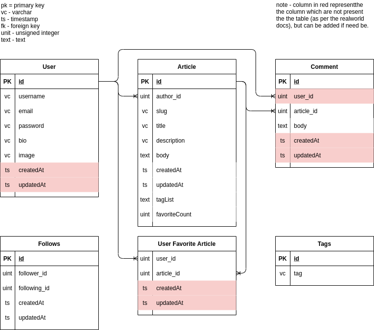

# 

> ## Deno/oak codebase containing real world examples (CRUD, auth, advanced patterns, etc) that adheres to the [RealWorld](https://github.com/gothinkster/realworld) spec and API

### [Demo](https://github.com/gothinkster/realworld)&nbsp;&nbsp;&nbsp;&nbsp;[RealWorld](https://github.com/gothinkster/realworld)

This codebase was created to demonstrate a fully fledged fullstack application built with **Deno/oak** including CRUD operations, authentication, routing, pagination, and more.

We've gone to great lengths to adhere to the **Deno/oak** community styleguides & best practices.

For more information on how to this works with other frontends/backends, head over to the [RealWorld](https://github.com/gothinkster/realworld) repo.

## How it works

```text
├── config.ts
├── .env
├── .env.example
├── src
    ├── main.ts                // this is the starting point of the application
    ├── main.router.ts         // defines routed
    ├── auth                   // handle authentication and authorization
    │   ├── interface          // contains dto and interface
    │   │   └── auth.interfacet.ts
    │   ├── controller         // handle request & response
    │   │   └── auth.controller.ts
    │   ├── service            // business logic
    │   │   └── auth.service.ts
    │   └── repository         // CRUD operations
    │       └── auth.repository.ts
    ├── profile                   // handle user related workload
    
```

## Getting started

start the server
> deno run --allow-net --allow-read --allow-env --unstable src/main.ts

note - you can use `denon` to start the server in watch mode, check [here](https://deno.land/x/denon@2.4.7) on how to install denon on your system.
to install denon
> deno install -qAf --unstable https://x.nest.land/denon@VERSION/denon.ts

note- make sure you provide the `VERSION`, else it may throw an error.

to start the server using denon, use following command
> denon run --allow-net --allow-read --allow-env --unstable src/main.ts

## API Specification

This application adheres to the api specifications set by the [Thinkster](https://github.com/gothinkster) team. This helps mix and match any backend with any other frontend without conflicts.

> [Full API Spec](https://github.com/gothinkster/realworld/tree/master/api)

More information regarding the project can be found [here](https://github.com/gothinkster/realworld)

## Environment variables

`.env` - Environment variables can be set in this file

Note : You can quickly set the database information and other variables in this file and have the application fully working.

## Database Schema



along with the above diagram, i have also added the xml file using which you can edit above diagram [here](https://app.diagrams.net/)
